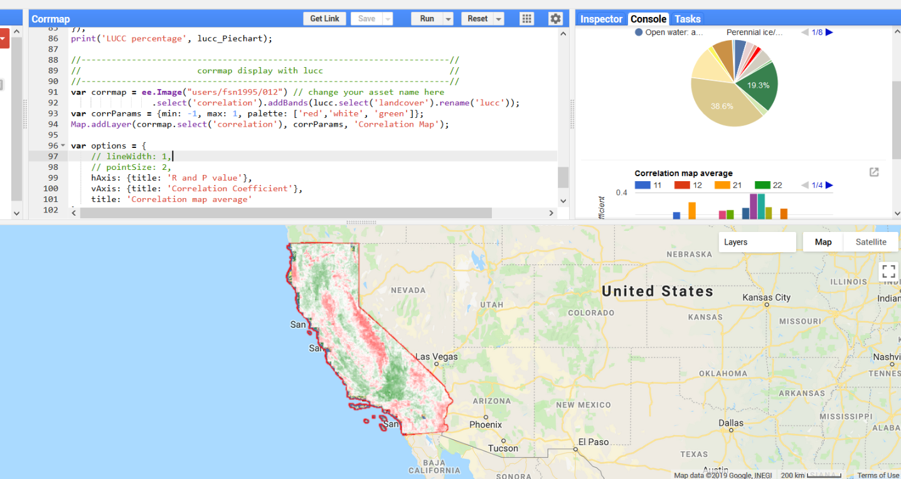

# Drought Analysis

This is an unpublished ongoing student project of drought analysis using Google Earth Engine (GEE).    
This is part of a group work about drought analysis by MSc students in Department of Earth Sciences, Uppsala University: de Mendonça Fileni, Felipe; Erikson, Torbjörn-Johannes; Feng, Shunan    
Supervisor: Pettersson, Rickard; Winterdahl, Mattias                   

Preliminary results will be presented during EGU general assembly 2019 in Vienna. [EGU 2019-19137](https://github.com/fsn1995/Drought-Analysis/blob/master/doc/EGU2019-19137_Drought%20Analysis.pdf)  

## 1. SPEI preparation
SPEI is computed using the R package: Beguería S. (2017) SPEIbase: R code used in generating the SPEI global database, [doi:10.5281/zenodo.834462](https://github.com/sbegueria/SPEIbase).
The 0.25 degree NOAH data is downloaded by from earthdata.nasa.gov by using [EarthdataDownload.py](https://github.com/fsn1995/PythonFSN/blob/master/EarthdataDownload.py). 
Note: 
- NOAH data is in a different format as the input required by SPEIbase, the suggestion is to convert it to the same format as the data used in the SPEI template.
- GEE does not accept netcdf file, so we did an extra step to convert SPEI.nc to .tif.

## 2. SPEI vs NDVI
It exports and displays the correlation map of monthly SPEI vs the sum of coming three-month NDVI anomalies. The example in this script is studying California, 1984-2018. But it could also be applied to other areas by changing several lines of script.

Instruction:
### 2.1 To have access to our uploaded SPEI, please click the links:
- SPEI 2m Cal https://code.earthengine.google.com/?asset=users/felipef93/SPEI_CAL
- SPEI 3m Cal https://code.earthengine.google.com/?asset=users/felipef93/SPEI_CAL_3m
### 2.2 copy paste all lines of script in SPEI vs NDVI.js to GEE code editor.
Change the study time here:
~~~javascript

// study time range
var year_start = 1984;
var year_end = 2018;
// month range of ndvi anomalies (May to July)
var month_start = 5;
var month_end = 7;
var speim = 4;// month of spei 

~~~
The example computes the three-month (May, June, July) sum of NDVI anomalies from 1984 to 2018 and correlates with SPEI in April.

For shorter period the correlation map could be displayed directly in GEE. For longer period, the results must be exported through tasks in GEE. The map could be exported to google drive or saved as GEE assets.
## 3. Corrmap Display with lucc
The correlation map exported to GEE asset from SEPI vs NDVI.js could be diaplayed and analyzed in this script. R and P values would be reported by different land cover.
change your asset name here before run:
~~~javascript
var corrmap = ee.Image("users/fsn1995/012") // change your asset name here
~~~

NDVI vs Water Balance NOAH.js
Discarded personal practice withspatial correlation of water balance(NOAH 0.25 degree) and NDVI (landsat 30m)

## References
- Vicente-Serrano S.M., Santiago Beguería, Juan I. López-Moreno, (2010) A Multi-scalar drought index sensitive to global warming: The Standardized Precipitation Evapotranspiration Index - SPEI. Journal of Climate 23: 1696-1718.
- Vicente-Serrano, S.M., Gouveia, C., Camarero, J.J., Begueria, S., Trigo, R., Lopez-Moreno, J.I., Azorin-Molina, C., Pasho, E., Lorenzo-Lacruz, J., Revuelto, J., Moran-Tejeda, E., Sanchez-Lorenzo, A., 2013. Response of vegetation to drought time-scales across global land biomes. Proceedings of the National Academy of Sciences 110, 52–57. https://doi.org/10.1073/pnas.1207068110
- Beguería, S., Vicente-Serrano, S.M., Fergus Reig, Borja Latorre. Standardized Precipitation Evapotranspiration Index (SPEI) revisited (2014): parameter fitting, evapotranspiration models, kernel weighting, tools, datasets and drought monitoring. International Journal of Climatology, 34: 3001-3023
- Sazib, N., Mladenova, I., Bolten, J., 2018. Leveraging the google earth engine for drought assessment using global soil moisture data. Remote Sensing 10. https://doi.org/10.3390/rs10081265  

Fileni, F., Feng, S., Erikson., T, Winterdahl, M., Pettersson, R., 2019. Spatial and temporal analysis of vegetation response to meteorological droughts in California, 1984-2018

## update 20190718
updates in computing ndvi anomalies. fast global scale study using MODIS product.